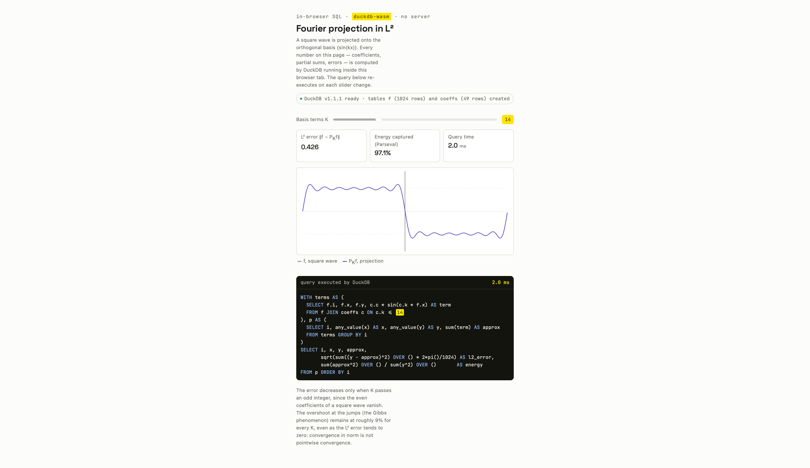

# fourier-duckdb

Fourier series as SQL. A target function — square, sawtooth, or triangle wave —
is projected onto the orthogonal basis {sin(kx)} in L², and every number on the
page (coefficients, partial sums, the L² error, the captured energy) is computed
by [DuckDB-Wasm](https://github.com/duckdb/duckdb-wasm) running in the browser.
Moving a slider re-executes the query and redraws the result.

The app is a demonstration of two things at once: that orthogonal projection in a
Hilbert space is a few lines of SQL, and that DuckDB-Wasm makes a database a
reasonable compute engine for interactive pages with no server.



## Prerequisites

- **Node 20 or newer** (`node --version`).

## Quick start

```bash
npm install
npm run dev        # development server (Vite)
npm run build      # static build into dist/
npm run preview    # serve the production build locally
```

`npm install && npm run dev` starts the app. Moving the slider re-executes SQL and
updates the plot, the three stat tiles, and the SQL panel; switching the target
function rebuilds the tables and continues.

## Fully offline / behind a corporate proxy

DuckDB-Wasm is installed from npm and **bundled locally**. The app uses the
manual bundle-selection API (`selectBundle` with explicit local URLs resolved via
Vite's `?url` imports) rather than `getJsDelivrBundles()`, so **nothing is fetched
from a CDN at runtime** — verify in the browser's network tab that there are no
requests to `jsdelivr.net` or any external origin.

### Configuring npm behind a TLS-inspecting proxy

`npm install` is the only step that touches the network. If your network sits
behind an inspecting proxy that re-signs TLS with a corporate root CA, point npm
at the proxy and at the CA bundle so the certificate chain validates:

```bash
npm config set proxy        http://proxy.corp.example:8080
npm config set https-proxy  http://proxy.corp.example:8080
npm config set cafile       /path/to/corporate-root-ca.pem
```

`cafile` should be the PEM file holding your proxy's root certificate. Prefer this
over `strict-ssl=false` — disabling certificate validation is a last resort, not a
fix. Once dependencies are installed, no further network access is needed.

### Serving the build offline

The built `dist/` folder is fully self-contained — the wasm, the worker, the CSS,
and the JS are all served from the same origin. Copy it to an air-gapped machine
and serve it with any static file server:

```bash
python -m http.server -d dist 8000
# then open http://localhost:8000/
```

## The SQL

Everything below also runs in the DuckDB CLI, unchanged. Sample the target on a
1024-point grid over [0, 2π) and compute the Fourier sine coefficients. The
coefficient of sin(kx) is the inner product ⟨f, sin(k·)⟩ divided by the squared
norm ‖sin(k·)‖², which in SQL is a `SUM` over a `SUM`:

```sql
CREATE TABLE f AS
SELECT i,
       2*pi()*i/1024 AS x,
       CASE WHEN 2*pi()*i/1024 < pi() THEN 1.0 ELSE -1.0 END AS y  -- square wave
FROM generate_series(0, 1023) t(i);

CREATE TABLE coeffs AS
SELECT k, sum(y * sin(k*x)) / sum(sin(k*x)^2) AS c
FROM f, generate_series(1, 49) t(k)
GROUP BY k;
```

Build the partial sum P_K f for a truncation K and measure it. The L² error and
the captured energy (Parseval's identity) are window aggregates over the same CTE,
so one statement returns both the curve and the statistics:

```sql
WITH terms AS (
  SELECT f.i, f.x, f.y, c.c * sin(c.k * f.x) AS term
  FROM f JOIN coeffs c ON c.k <= 9          -- K = 9
), p AS (
  SELECT i, any_value(x) AS x, any_value(y) AS y, sum(term) AS approx
  FROM terms GROUP BY i
)
SELECT i, x, y, approx,
       sqrt(sum((y - approx)^2) OVER () * 2*pi()/1024) AS l2_error,
       sum(approx^2) OVER () / sum(y^2) OVER ()       AS energy
FROM p ORDER BY i;
```

Switching the target function in the UI drops and recreates `f` and `coeffs` with
a different `y` expression (sawtooth or triangle) and re-runs the current query.

## Checking the numbers

The square wave has the closed-form series (4/π)·Σ_{odd k} sin(kx)/k. Two
consequences serve as tests, both confirmed by the demo:

- At **K = 1**, the captured energy is 8/π² ≈ **81%**.
- Even coefficients are zero, so the L² error only drops when K passes an **odd**
  integer; by **K = 49** the error is **below 0.3**.

The overshoot at the jumps is the **Gibbs phenomenon**: about 9% of the jump
height, and it does *not* shrink as K grows, even though the L² error tends to
zero. That is the difference between pointwise convergence and convergence in
norm, and it is why L² is the natural setting for Fourier series.

The triangle wave is continuous, so its coefficients decay as **1/k²** rather than
**1/k**; convergence is visibly faster and there is no overshoot.

## Why this is a Hilbert space

L²([0, 2π)) is a vector space with inner product ⟨f, g⟩ = ∫ f(x)g(x) dx, complete
in the induced norm (Riesz–Fischer). Completeness is what the demo exercises:
Parseval bounds the coefficient sums, which makes the partial sums a Cauchy
sequence, and completeness guarantees the sequence converges to an element of the
space. The discrete object computed here — ℝ¹⁰²⁴ with a weighted dot product — is
a finite-dimensional inner-product space, automatically complete, and approximates
the continuous object as the grid is refined.

## Project structure

```
index.html        page markup
src/main.js       wiring: slider, selector, stats, SQL panel, run-counter guard
src/sql.js        DuckDB-Wasm setup, target expressions, queries
src/plot.js       canvas rendering
src/style.css     styles (system font stack; no web fonts)
vite.config.js    relative-base static build
```

## License

MIT
