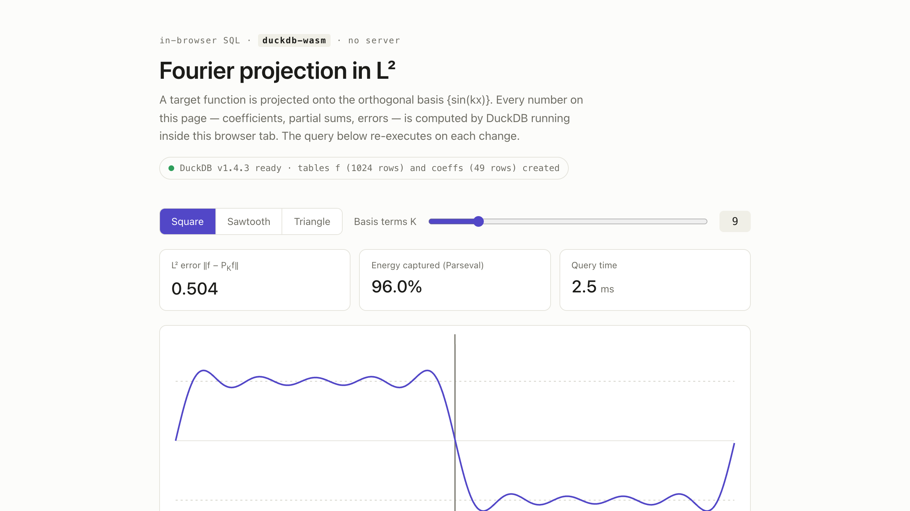

# fourier-duckdb

A static web app that computes a Fourier sine series in SQL. A target function
(square, sawtooth, or triangle wave) is projected onto the orthogonal basis
{sin(kx)} in L², and the coefficients, partial sums, L² error, and captured energy
are computed by [DuckDB-Wasm](https://github.com/duckdb/duckdb-wasm) in the
browser. Moving a slider for the number of basis terms K re-executes the query and
redraws the result.

The orthogonal projection is expressed as a few SQL statements, and DuckDB-Wasm
runs them in the page with no server.



## Prerequisites

Node 20 or newer (`node --version`).

## Quick start

```bash
npm install
npm run dev        # development server (Vite)
npm run build      # static build into dist/
npm run preview    # serve the production build locally
```

`npm install && npm run dev` starts the app. Moving the slider re-executes the SQL
and updates the plot, the stat tiles, and the SQL panel. Switching the target
function rebuilds the tables and re-runs the current query.

## Offline use and corporate proxies

DuckDB-Wasm is installed from npm and bundled locally. The app selects the wasm
and worker with the manual `selectBundle` API and explicit local URLs resolved
through Vite's `?url` imports, not `getJsDelivrBundles()`. No assets are fetched
from a CDN at runtime. The browser network tab shows no requests to `jsdelivr.net`
or any external origin.

### npm behind a TLS-inspecting proxy

`npm install` is the only step that needs the network. On a network with a proxy
that re-signs TLS using a corporate root CA, set the proxy and the CA bundle so
the certificate chain validates:

```bash
npm config set proxy        http://proxy.corp.example:8080
npm config set https-proxy  http://proxy.corp.example:8080
npm config set cafile       /path/to/corporate-root-ca.pem
```

`cafile` is the PEM file containing the proxy's root certificate. Use it rather
than `strict-ssl=false`, which disables certificate validation. After install, no
further network access is required.

### Serving the build offline

The built `dist/` folder is self-contained. The wasm, worker, CSS, and JS are
served from the same origin. Copy it to an air-gapped machine and serve it with
any static file server:

```bash
python -m http.server -d dist 8000
# then open http://localhost:8000/
```

## The SQL

The statements below also run in the DuckDB CLI without changes. Sample the target
on a 1024-point grid over [0, 2π) and compute the Fourier sine coefficients. The
coefficient of sin(kx) is the inner product ⟨f, sin(k·)⟩ divided by the squared
norm ‖sin(k·)‖², written in SQL as a `SUM` over a `SUM`:

```sql
CREATE TABLE f AS
SELECT i,
       2*pi()*i/1024 AS x,
       CASE WHEN 2*pi()*i/1024 < pi() THEN 1.0 ELSE -1.0 END AS y  -- square wave
FROM generate_series(0, 1023) t(i);

CREATE TABLE coeffs AS
SELECT k, sum(y * sin(k*x)) / sum(sin(k*x)^2) AS c
FROM f, generate_series(1, 49) t(k)
GROUP BY k;
```

Build the partial sum P_K f for a truncation K and measure it. The L² error and
the captured energy (Parseval's identity) are window aggregates over the same CTE,
so one statement returns the curve and the statistics:

```sql
WITH terms AS (
  SELECT f.i, f.x, f.y, c.c * sin(c.k * f.x) AS term
  FROM f JOIN coeffs c ON c.k <= 9          -- K = 9
), p AS (
  SELECT i, any_value(x) AS x, any_value(y) AS y, sum(term) AS approx
  FROM terms GROUP BY i
)
SELECT i, x, y, approx,
       sqrt(sum((y - approx)^2) OVER () * 2*pi()/1024) AS l2_error,
       sum(approx^2) OVER () / sum(y^2) OVER ()       AS energy
FROM p ORDER BY i;
```

Selecting a different target function in the UI drops and recreates `f` and
`coeffs` with a different `y` expression (sawtooth or triangle) and re-runs the
current query.

## Checking the numbers

The square wave has the closed-form series (4/π)·Σ_{odd k} sin(kx)/k. Two of its
properties are confirmed by the app:

- At K = 1 the captured energy is 8/π² ≈ 81%.
- Even coefficients are zero, so the L² error decreases only when K passes an odd
  integer. By K = 49 the error is below 0.3.

The overshoot at the jumps is the Gibbs phenomenon, about 9% of the jump height.
It stays at that height as K grows while the L² error tends to zero. Pointwise
convergence and convergence in norm differ, and L² measures the second.

The triangle wave is continuous, so its coefficients decay as 1/k² rather than
1/k. Its partial sums converge faster and show no overshoot.

## Why this is a Hilbert space

L²([0, 2π)) is a vector space with inner product ⟨f, g⟩ = ∫ f(x)g(x) dx, complete
in the induced norm (Riesz–Fischer). Parseval bounds the coefficient sums, which
makes the partial sums a Cauchy sequence, and completeness implies the sequence
converges to an element of the space. The discrete object computed here is ℝ¹⁰²⁴
with a weighted dot product, a finite-dimensional inner-product space that is
complete, and it approximates the continuous object as the grid is refined.

## Project structure

```
index.html        page markup
src/main.js       wiring: slider, selector, stats, SQL panel, run-counter guard
src/sql.js        DuckDB-Wasm setup, target expressions, queries
src/plot.js       canvas rendering
src/style.css     styles (system font stack; no web fonts)
vite.config.js    relative-base static build
```

## License

MIT
